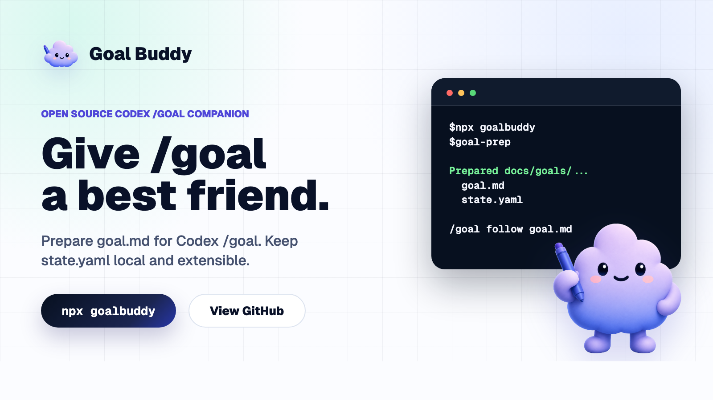

# Cicero Goals

<p align="center">
  <a href="https://github.com/amacdonald-cgs/cicero-goals">
    
  </a>
</p>

<p align="center">
  <strong>Turn open-ended Codex work into one reviewable goal board.</strong>
</p>

<p align="center">
  <a href="https://www.npmjs.com/package/cicero-goals"></a>
  <a href="LICENSE"></a>
  <a href="https://cicerogoals.dev"></a>
</p>

Cicero Goals is a local Codex companion for work that is too broad to trust to a single prompt. It turns a vague request into a `goal.md` charter, a machine-readable `state.yaml` board, role-tagged Scout/Judge/Worker tasks, compact receipts, and verification before completion.

The repo still keeps `goalbuddy/` as the canonical tracked skill payload and `plugins/goalbuddy/` as the repo-local plugin scaffold, but the published package, plugin identity, and installed workstream surface now use `cicero-goals`.

```bash
npx cicero-goals
```

Or install it globally:

```bash
npm i -g cicero-goals
```

Compatibility aliases remain available during the migration window:

```bash
goalbuddy --help
goal-maker --help
```

Then restart Codex and invoke the installed skill:

```text
$goal-prep
```

`$goal-prep` prepares the Cicero Goals-style deep board and prints the `/goal` command to run next. It does not start `/goal` automatically.

## Why Cicero Goals Exists

Long Codex goals drift. A request like "improve this project" can turn into unbounded edits, stale verification, and premature completion claims.

Cicero Goals gives Codex a durable loop:

```text
vague goal -> Scout -> Judge -> Worker -> receipt -> verify -> repeat
```

The main `/goal` thread acts as PM. It owns the board, keeps exactly one active task, delegates when useful, records receipts, and only completes after a Judge or PM audit proves the original outcome is done.

## Identity

- `cicero-goals`: canonical package, plugin, install, and CLI identity
- `goalbuddy`: compatibility CLI alias and tracked repo payload path
- `goal-maker`: legacy compatibility CLI alias

In the current branch, `cicero-goals` state lives under:

```text
.codex/cicero-goals/developers/<developer>/
  current.yaml
  index.yaml
  inbox/
  goals/
```

The existing Cicero Goals board model still exists for deep orchestration, but not every tracked workstream needs the full Scout/Judge/Worker loop.

## What You Get Locally

```text
docs/goals/<slug>/
  goal.md
  state.yaml
  notes/
```

- `goal.md` is the editable charter: objective, constraints, tranche, and stop rule.
- `state.yaml` is the board truth: task status, active task, receipts, and verification.
- `notes/` holds longer Scout, Judge, or PM findings when a task receipt would be too large.

## The Operating Model

Cicero Goals uses four primitives:

- **Charter**: states what this goal is trying to accomplish and what must stay true.
- **Board**: tracks tasks, status, receipts, and verification freshness.
- **Task**: exactly one active Scout, Judge, Worker, or PM task.
- **Receipt**: compact proof for every completed, blocked, or escalated task.

The default agents are installed with the skill:

- **Scout** maps repo evidence, workflows, constraints, risks, and candidate next tasks.
- **Judge** resolves ambiguity, scope, risk, task selection, and completion claims.
- **Worker** performs one bounded implementation or recovery slice with explicit files and checks.

## Install And Check Readiness

Install and enable the native Codex plugin:

```bash
npx cicero-goals
```

Restart Codex, then use `$goal-prep`. To add the optional extension bundle:

```bash
npx cicero-goals extend install --all
```

If you prefer a global executable, install the npm package globally and run `cicero-goals`:

```bash
npm i -g cicero-goals
cicero-goals
```

Compatibility aliases still work:

```bash
goalbuddy
goal-maker
```

Use the skill-only fallback if your Codex build does not support plugins:

```bash
npx cicero-goals install
npx cicero-goals update
```

Native Codex `/goal` is still an under-development Codex feature. Before relying on the printed command, confirm your local Codex runtime is logged in and has goals enabled:

```bash
codex login status
codex features enable goals
npx cicero-goals doctor --goal-ready
```

Repair only the bundled agent definitions:

```bash
npx cicero-goals agents
```

Check the local install:

```bash
npx cicero-goals doctor
```

Check whether a newer Cicero Goals release is available:

```bash
npx cicero-goals check-update
```

Use a non-default Codex home:

```bash
cicero-goals current --bootstrap --codex-home /path/to/codex-home
```

`plugin install`, `install`, `update`, and `doctor` also support `--json` when an agent or script needs structured output.

## Run A Goal

After `$goal-prep` creates or repairs the board, start the run with the printed command:

```text
/goal Follow docs/goals/<slug>/goal.md.
```

Check board health at any time:

```bash
node ~/.codex/skills/cicero-goals/scripts/check-goal-state.mjs docs/goals/<slug>/state.yaml
```

Open a live local board for that goal:

```bash
npx cicero-goals board docs/goals/<slug>
```

This writes `docs/goals/<slug>/.cicero-goals-board`, serves it on loopback, and streams `state.yaml` plus `notes/` changes to the browser without a manual reload.

For a broad prompt like "Improve my project," the first active task should usually be Scout, not Worker:

```yaml
tasks:
  - id: T001
    type: scout
    assignee: Scout
    status: active
    objective: "Map repo health and identify improvement candidates."
    receipt: null
  - id: T002
    type: judge
    assignee: Judge
    status: queued
    objective: "Choose the next safe implementation task."
    receipt: null
  - id: T003
    type: worker
    assignee: Worker
    status: queued
    objective: "Execute the safe implementation task selected by Judge."
    allowed_files: []
    verify: []
    stop_if:
      - "Need files outside allowed_files."
      - "Verification fails twice."
    receipt: null
```

## Current Workstream Commands

The repo now also supports a repo-local `cicero-goals` substrate for tracked workstreams:

```bash
cicero-goals current --bootstrap
cicero-goals begin "Rebrand legacy surfaces to cicero-goals"
cicero-goals pause
cicero-goals resume rebrand-legacy-surfaces-to-cicero-goals
cicero-goals end
cicero-goals use-inbox
cicero-goals use-goal rebrand-legacy-surfaces-to-cicero-goals
cicero-goals goal-runtime attach
```

Compatibility aliases `goalbuddy` and `goal-maker` still forward to the same commands.

## Extensions

The npm package is the stable core. Optional extensions live under `extend/` and are discovered from the GitHub-hosted `extend/catalog.json`, so users do not need a new npm release for every integration.

```bash
npx cicero-goals extend
npx cicero-goals extend github-pr-workflow
npx cicero-goals extend install github-pr-workflow --dry-run
npx cicero-goals extend install --all --dry-run
npx cicero-goals extend install --all
```

`cicero-goals extend` shows available extensions and detail commands. `cicero-goals extend <id>` shows local install state, activation state, credential requirements, safe-by-default status, and missing environment variables.

Current catalog examples include:

- `github-pr-workflow`: prepares receipt-aligned commit and PR handoff text.
- `github-projects`: mirrors Cicero Goals boards into GitHub Projects.
- `ai-diff-risk-review`: summarizes risk in the current diff.
- `ci-failure-triage`: maps failing CI back to likely causes and next tasks.
- `docs-drift-audit`: checks whether docs still match implementation.
- `codebase-onboarding-map`: creates a concise repo map from files and conventions.
- `release-readiness`: checks whether a goal is ready to publish.

Extensions can publish, report, intake, or add role guidance. They are not board truth. `state.yaml` remains authoritative.

## Compatibility Window

`goal-maker` and `goalbuddy` remain compatibility aliases. Human-facing guidance should use:

```bash
npx cicero-goals
```

Machine-readable commands such as `npx goal-maker install --json` keep JSON output clean so existing automation can migrate safely.

Release automation for future npm publishes is documented in [RELEASE.md](RELEASE.md).

## Examples

- `examples/improve-goal-maker/`: a small completed reliability run.
- `examples/extend-catalog-workflow/`: a larger run from product framing through implementation and cleanup.
- `examples/github-pr-workflow-extension/pr-handoff.md`: an extension-generated PR handoff artifact.

## Repo Map

- `goalbuddy/SKILL.md`: canonical Codex skill
- `goalbuddy/agents/`: Scout, Judge, and Worker definitions
- `goalbuddy/templates/`: `goal.md`, `state.yaml`, and `note.md`
- `goalbuddy/scripts/check-goal-state.mjs`: v2 board checker
- `internal/cli/goal-maker.mjs`: npm installer CLI
- `plugins/goalbuddy/`: repo-local Codex plugin package scaffold
- `extend/` and `extend/catalog.json`: GitHub-hosted extension surface
- `examples/`: completed sample runs

## Status

`0.2.x` is the v2 board and receipt model. It intentionally rejects old v1 `gate`, `units`, `artifacts`, and `evidence.jsonl` goal folders instead of auto-migrating them.

Use Cicero Goals to structure autonomous Codex work. Keep relying on repo-specific `AGENTS.md`, tests, and CI for repo facts.

## License

MIT
